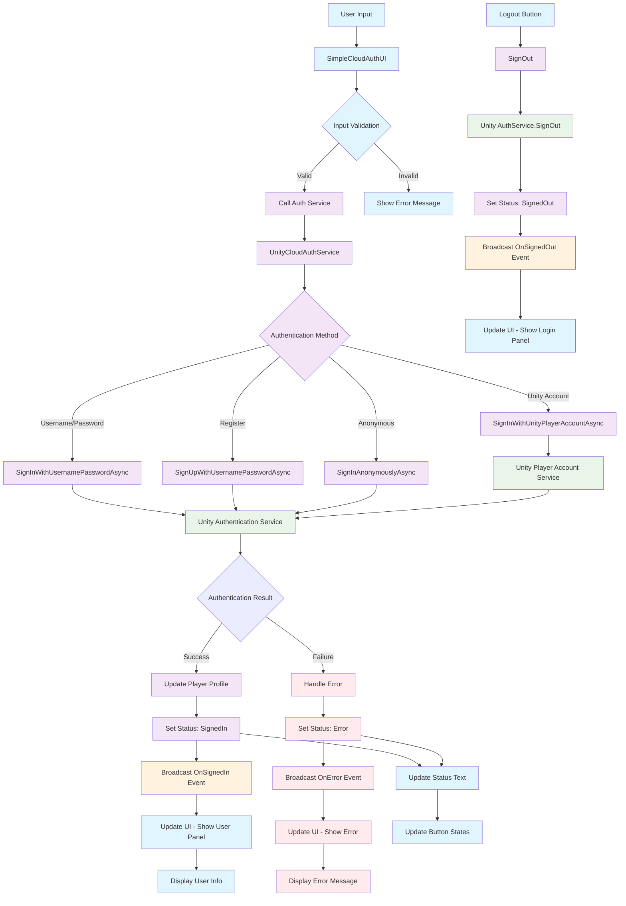

# Unity Cloud Authentication System Documentation

## Overview
This document describes the Unity Cloud Authentication System, a comprehensive authentication solution that provides user registration, login, and profile management capabilities through Unity's Cloud Services.

## System Architecture

### High-Level Architecture

The system follows a **3-tier architecture** with clear separation of concerns:

```
┌─────────────────────────────────────────────────────────┐
│                    UI Layer                             │
│  ┌─────────────────────────────────────────────────┐    │
│  │            SimpleCloudAuthUI                    │    │
│  │  • Login/Register Forms                         │    │
│  │  • User Profile Display                         │    │
│  │  • Input Validation                             │    │
│  │  • Event Handling                               │    │
│  └─────────────────────────────────────────────────┘    │
└─────────────────────────────────────────────────────────┘
                            │
                            ▼
┌─────────────────────────────────────────────────────────┐
│                 Service Layer                           │
│  ┌─────────────────────────────────────────────────┐    │
│  │         UnityCloudAuthService                   │    │
│  │  • Authentication Logic                         │    │
│  │  • Profile Management                           │    │
│  │  • Status Management                            │    │
│  │  • Event Broadcasting                           │    │
│  └─────────────────────────────────────────────────┘    │
└─────────────────────────────────────────────────────────┘
                            │
                            ▼
┌─────────────────────────────────────────────────────────┐
│              Unity Services Layer                       │
│  ┌─────────────────────────────────────────────────┐    │
│  │     Unity Authentication Service                │    │
│  │  • Core Authentication                          │    │
│  │  • Player Account Service                       │    │
│  │  • Cloud Backend Integration                    │    │
│  └─────────────────────────────────────────────────┘    │
└─────────────────────────────────────────────────────────┘
```

## Core Components

### 1. UnityCloudAuthService
**Location**: `Assets/_MHAsset/Scripts/UnityCloudAuthService.cs`

**Responsibilities**:
- Unity Services initialization and lifecycle management
- Authentication method implementations (Username/Password, Anonymous, Unity Player Account)
- Password management and profile updates
- Event system for authentication state changes
- Error handling and logging

**Key Features**:
- Auto-initialization support
- Comprehensive event system
- Status tracking with `AuthStatus` enum
- Debug logging capabilities
- Player profile management

### 2. SimpleCloudAuthUI
**Location**: `Assets/_MHAsset/Scripts/UI/SimpleCloudAuthUI.cs`

**Responsibilities**:
- User interface for authentication flows
- Input validation and user feedback
- Event subscription and UI state management
- Panel switching between login and user views

**Key Features**:
- Dynamic panel switching
- Real-time status updates
- Input validation with error messages
- Button state management during operations

## Data Flow Diagram

The following diagram illustrates the complete authentication flow from user interaction to UI updates:



### Legend:
- **Blue (UI Layer)**: User interface components and interactions
- **Purple (Service Layer)**: Authentication service logic and management
- **Green (Unity Layer)**: Unity's built-in authentication services
- **Orange (Event Layer)**: Event broadcasting and handling
- **Red (Error Layer)**: Error handling and display

## Detailed Component Analysis

### Authentication Status Flow

The system uses an `AuthStatus` enum to track the current state:

```csharp
public enum AuthStatus
{
    NotInitialized,    // Services not yet initialized
    Initializing,      // Unity Services starting up
    SignedOut,         // User not authenticated
    SigningIn,         // Authentication in progress
    SignedIn,          // User successfully authenticated
    SigningOut,        // Logout in progress
    Error              // Authentication error occurred
}
```

### Event System

The system uses a comprehensive event-driven architecture:

| Event | Trigger | Handler |
|-------|---------|---------|
| `OnAuthStatusChanged` | Status changes | UI updates button states |
| `OnSignedIn` | Successful authentication | Show user panel, display profile |
| `OnSignedOut` | User logout | Show login panel, clear data |
| `OnError` | Authentication failure | Display error message |
| `OnPasswordChanged` | Password operations | Show confirmation |
| `OnProfileUpdated` | Profile changes | Refresh user display |

### Authentication Methods

The service supports multiple authentication strategies:

1. **Username/Password Authentication**
   - Standard email/username and password login
   - User registration with validation
   - Password change functionality

2. **Anonymous Authentication**
   - Temporary authentication without credentials
   - Useful for guest users or trial experiences

3. **Unity Player Account**
   - Single sign-on through Unity ecosystem
   - Seamless integration with Unity services

### Security Considerations

- **Input Validation**: All user inputs are validated before processing
- **Error Handling**: Comprehensive exception handling with user-friendly messages
- **Token Management**: Automatic handling of access tokens and session expiration
- **Password Security**: Passwords are handled securely through Unity's authentication service

### Integration Points

#### Unity Services Dependencies
- `Unity.Services.Core` - Core services initialization
- `Unity.Services.Authentication` - Authentication functionality
- `Unity.Services.Authentication.PlayerAccounts` - Player account integration

#### UI Dependencies
- `TextMeshPro` - Text rendering
- `UnityEngine.UI` - UI components

## Usage Guidelines

### Setup Requirements
1. Unity Services must be properly configured in the Unity Dashboard
2. Authentication service must be enabled in Unity Cloud Build
3. Project must be linked to a Unity Cloud Project ID

### Best Practices
1. Always check `IsInitialized` before making authentication calls
2. Subscribe to events in `OnEnable` and unsubscribe in `OnDisable`
3. Handle all authentication exceptions gracefully
4. Provide clear feedback to users during authentication processes
5. Validate user inputs before sending to the service

### Error Handling Strategy
- **Network Errors**: Retry logic with exponential backoff
- **Authentication Errors**: Clear, actionable error messages
- **Validation Errors**: Immediate feedback with correction guidance
- **Service Errors**: Fallback to offline mode when possible

## Extensibility

The system is designed for easy extension:

- **Custom Authentication Providers**: Add new authentication methods by extending the service
- **Additional UI Components**: Create specialized UI controllers for different use cases
- **Profile Extensions**: Extend the `PlayerProfile` struct for additional user data
- **Event Handlers**: Add custom event handlers for specific business logic

## Performance Considerations

- **Async Operations**: All authentication operations are asynchronous to prevent UI blocking
- **Event Unsubscription**: Proper cleanup prevents memory leaks
- **Caching**: Player profiles are cached to reduce API calls
- **Error Recovery**: Graceful degradation when services are unavailable 