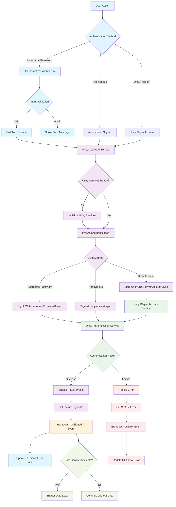
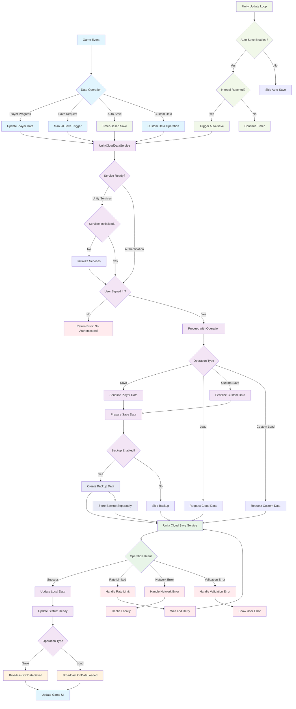
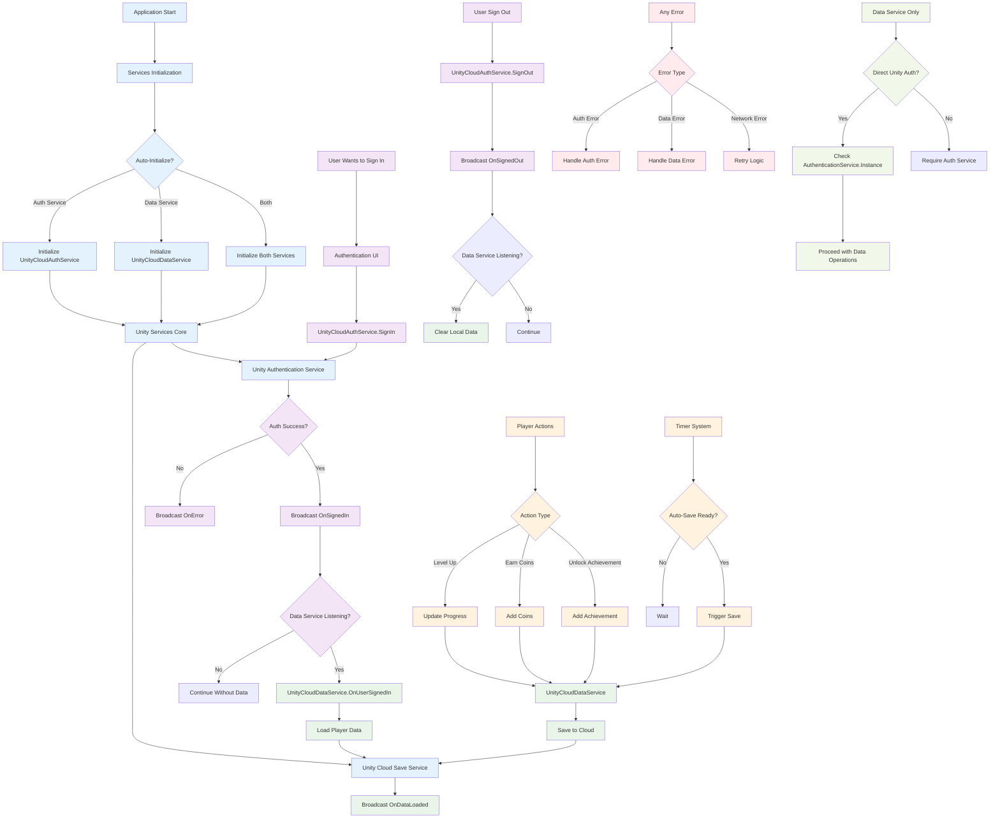

# Unity Cloud System Documentation

## Overview
This document describes the Unity Cloud System, a comprehensive cloud-based solution that provides authentication, data persistence, and user management capabilities through Unity's Cloud Services. The system consists of two main service classes that work independently while maintaining seamless integration for complete cloud functionality.

## System Architecture

### High-Level Architecture

The Unity Cloud System follows a **modular, service-oriented architecture** with clear separation of concerns:

```
┌─────────────────────────────────────────────────────────────────────────────┐
│                             Application Layer                               │
│  ┌─────────────────────────────────────┐   ┌─────────────────────────────┐  │
│  │         UI Components               │   │      Game Logic             │  │
│  │  • SimpleCloudAuthUI                │   │  • CloudDataExample         │  │
│  │  • CloudAuthUIController            │   │  • Game Controllers         │  │
│  │  • CloudDataUI                      │   │  • Player Actions           │  │
│  │  • Form Validation                  │   │  • Achievement Systems      │  │
│  └─────────────────────────────────────┘   └─────────────────────────────┘  │
└─────────────────────────────────────────────────────────────────────────────┘
                                    │
                                    ▼
┌─────────────────────────────────────────────────────────────────────────────┐
│                              Service Layer                                  │
│  ┌─────────────────────────────────────┐   ┌─────────────────────────────┐  │
│  │      UnityCloudAuthService          │   │    UnityCloudDataService    │  │
│  │  • User Authentication             │   │  • Player Data Management   │  │
│  │  • Profile Management              │   │  • Cloud Save Operations    │  │
│  │  • Session Handling                │   │  • Auto-Save System         │  │
│  │  • Multiple Auth Methods           │   │  • Backup & Recovery        │  │
│  │  • Password Management             │   │  • Custom Data Storage      │  │
│  │  • Event Broadcasting              │   │  • Status Management        │  │
│  └─────────────────────────────────────┘   └─────────────────────────────┘  │
│                    │                                     │                  │
│                    └──────────── Optional ───────────────┘                  │
│                              Integration                                     │
└─────────────────────────────────────────────────────────────────────────────┘
                                    │
                                    ▼
┌─────────────────────────────────────────────────────────────────────────────┐
│                           Unity Services Layer                              │
│  ┌─────────────────────────────────────┐   ┌─────────────────────────────┐  │
│  │     Unity Authentication Service    │   │   Unity Cloud Save Service  │  │
│  │  • Core Authentication             │   │  • Player Data Storage       │  │
│  │  • Player Account Integration      │   │  • JSON Serialization        │  │
│  │  • Session Management              │   │  • Rate Limiting             │  │
│  │  • Token Management                │   │  • Conflict Resolution       │  │
│  └─────────────────────────────────────┘   └─────────────────────────────┘  │
│  ┌─────────────────────────────────────────────────────────────────────────┐ │
│  │                     Unity Services Core                                 │ │
│  │  • Service Initialization • Project Configuration • Error Handling     │ │
│  └─────────────────────────────────────────────────────────────────────────┘ │
└─────────────────────────────────────────────────────────────────────────────┘
```

## Core Components

### 1. UnityCloudAuthService
**Location**: `Assets/_MHAsset/Scripts/UnityCloudAuthService.cs`

**Primary Purpose**: Comprehensive user authentication and profile management wrapper around Unity's Authentication Service.

**Key Responsibilities**:
- Unity Services initialization and lifecycle management
- Multiple authentication method implementations
- User profile management and updates
- Password management and security operations
- Event system for authentication state changes
- Session management and token handling

**Core Features**:
#### Authentication Methods:
- **Username/Password Authentication**: Standard credential-based sign-in/sign-up
- **Anonymous Authentication**: Guest access without credentials
- **Unity Player Account**: Single sign-on through Unity ecosystem
- **Automatic Session Management**: Handles token refresh and expiration

#### Profile Management:
- **Player Name Updates**: Modify display name
- **Profile Information**: Access player details and metadata
- **Custom Profile Extensions**: Extensible profile structure

#### Security Features:
- **Password Management**: Change passwords, reset requests
- **Token Security**: Secure access token handling
- **Session Validation**: Automatic session state validation

#### Status Tracking:
```csharp
public enum AuthStatus
{
    NotInitialized,    // Services not yet initialized
    Initializing,      // Unity Services starting up
    SignedOut,         // User not authenticated
    SigningIn,         // Authentication in progress
    SignedIn,          // User successfully authenticated
    SigningOut,        // Logout in progress
    Error              // Authentication error occurred
}
```

### 2. UnityCloudDataService
**Location**: `Assets/_MHAsset/Scripts/UnityCloudDataService.cs`

**Primary Purpose**: Independent cloud-based data persistence service that works directly with Unity Cloud Save.

**Key Responsibilities**:
- Player data serialization and cloud storage
- Auto-save system with configurable intervals
- Backup and recovery mechanisms
- Custom data type storage and retrieval
- Authentication-aware data operations
- Event system for data operation status

**Core Features**:
#### Data Management:
- **Player Data Structure**: Comprehensive player information storage
- **Custom Data Storage**: Generic key-value data persistence
- **JSON Serialization**: Automatic object serialization/deserialization
- **Data Validation**: Input validation before cloud operations

#### Auto-Save System:
- **Configurable Intervals**: Customizable save frequency (minimum 1 minute)
- **Conditional Triggers**: Only saves when authenticated and ready
- **Event Notifications**: Broadcasts when auto-save occurs
- **Manual Control**: Runtime enable/disable capabilities

#### Backup & Recovery:
- **Automatic Backups**: Creates backup copies during save operations
- **Restore Functionality**: Ability to restore from previous backup
- **Timestamp Tracking**: Backup creation time monitoring
- **Error Recovery**: Fallback options when main save fails

#### Status Tracking:
```csharp
public enum DataSaveStatus
{
    NotInitialized,    // Service not yet set up
    Ready,             // Ready for operations
    Saving,            // Save operation in progress
    Loading,           // Load operation in progress
    Error              // Operation failed
}
```

## Data Flow Diagrams

### Authentication Flow Diagram



### Data Persistence Flow Diagram



### Integrated System Flow



## System Integration Patterns

### Pattern 1: Integrated Services (Recommended for Complete Systems)
Both services work together with event-driven communication:

```csharp
// Authentication triggers data loading
_authService.OnSignedIn += (profile) => {
    // Data service automatically loads player data
    // when user signs in
};

// Data service can access auth information
bool canSave = _authService.IsSignedIn && _dataService.IsReady;
```

### Pattern 2: Independent Data Service
Data service works directly with Unity Authentication:

```csharp
// Data service operates independently
bool canSave = AuthenticationService.Instance.IsSignedIn && 
               _dataService.IsReady;

// Direct authentication checking
string playerId = AuthenticationService.Instance.PlayerId;
```

### Pattern 3: Authentication-Only Service
Use only authentication without data persistence:

```csharp
// Simple authentication for basic user management
await _authService.SignInWithUsernamePasswordAsync(username, password);
string accessToken = _authService.GetAccessToken();
```

## Event System Architecture

### Authentication Events
```csharp
// Status changes
OnAuthStatusChanged(AuthStatus status)

// Authentication success
OnSignedIn(PlayerProfile profile)

// User logout
OnSignedOut()

// Profile updates
OnProfileUpdated(PlayerProfile profile)

// Password operations
OnPasswordChanged(string message)

// Error handling
OnError(string error)
```

### Data Service Events
```csharp
// Status changes
OnDataStatusChanged(DataSaveStatus status)

// Data operations
OnDataLoaded(PlayerData data)
OnDataSaved(PlayerData data)

// Auto-save notifications
OnAutoSaveTriggered()

// Error handling
OnDataError(string error)
```

## Data Models

### PlayerProfile (Authentication)
```csharp
public struct PlayerProfile
{
    public PlayerInfo playerInfo;  // Unity's player information
    public string Name;           // Display name
}
```

### PlayerData (Data Service)
```csharp
public class PlayerData
{
    public string playerName;           // Player display name
    public int level;                   // Character level
    public float experience;            // Experience points
    public int coins;                   // Virtual currency
    public List<string> achievements;   // Unlocked achievements
    public DateTime lastSaveTime;       // Last save timestamp
}
```

## Configuration Options

### UnityCloudAuthService Configuration
- **autoInitialize**: Automatic Unity Services initialization
- **debugMode**: Enable detailed logging

### UnityCloudDataService Configuration
- **_autoSaveEnabled**: Enable automatic saving
- **_autoSaveInterval**: Save frequency (minimum 60 seconds)
- **_enableBackups**: Create backup copies during saves
- **_autoInitializeServices**: Automatic Unity Services initialization
- **_debugMode**: Enable detailed logging

## Error Handling Strategy

### Authentication Errors
- **Network Errors**: Retry logic with user feedback
- **Invalid Credentials**: Clear error messages with correction guidance
- **Service Unavailable**: Graceful degradation to offline mode
- **Session Expired**: Automatic re-authentication prompts

### Data Service Errors
- **Rate Limiting**: Exponential backoff retry
- **Network Issues**: Local caching with sync when available
- **Validation Errors**: Input validation with user feedback
- **Storage Full**: Cleanup recommendations

## Performance Considerations

### Optimization Strategies
- **Async Operations**: All cloud operations are non-blocking
- **Local Caching**: Frequently accessed data cached locally
- **Batch Operations**: Group multiple data changes before saving
- **Selective Syncing**: Only sync changed data when possible

### Memory Management
- **Event Cleanup**: Proper unsubscription prevents memory leaks
- **Data Clearing**: Clear cached data on sign-out
- **JSON Optimization**: Efficient serialization/deserialization

## Security Features

### Authentication Security
- **Token Management**: Secure access token handling
- **Session Validation**: Automatic session state verification
- **Password Security**: Secure password change operations
- **Input Validation**: Sanitized input processing

### Data Security
- **Authentication Required**: All data operations require valid authentication
- **Player Isolation**: Each player can only access their own data
- **Backup Integrity**: Secure backup creation and restoration
- **Error Sanitization**: Safe error message handling

## Best Practices

### Development Guidelines
1. **Always Check Authentication**: Verify authentication status before operations
2. **Handle Async Operations**: Use proper async/await patterns
3. **Subscribe to Events**: Monitor operation status through events
4. **Implement Error Handling**: Comprehensive error management for all operations
5. **Test Offline Scenarios**: Ensure graceful degradation when services unavailable

### Integration Recommendations
1. **Use Event-Driven Architecture**: Leverage the event system for loose coupling
2. **Implement Fallback Strategies**: Local caching for offline scenarios
3. **Monitor Performance**: Track operation timing and success rates
4. **Validate User Input**: Client-side validation before cloud operations
5. **Provide User Feedback**: Clear status updates during long operations

## Extensibility

The system is designed for easy extension:

### Custom Authentication Providers
- Extend UnityCloudAuthService for additional auth methods
- Implement custom profile data structures
- Add third-party authentication integrations

### Enhanced Data Models
- Extend PlayerData for game-specific requirements
- Implement custom data types with generic storage
- Add complex data relationships and validation

### Advanced Features
- Implement real-time data synchronization
- Add conflict resolution for concurrent edits
- Create data analytics and usage tracking
- Implement advanced backup strategies

This architecture provides a robust, scalable foundation for Unity cloud-based applications with flexible integration options and comprehensive error handling. 